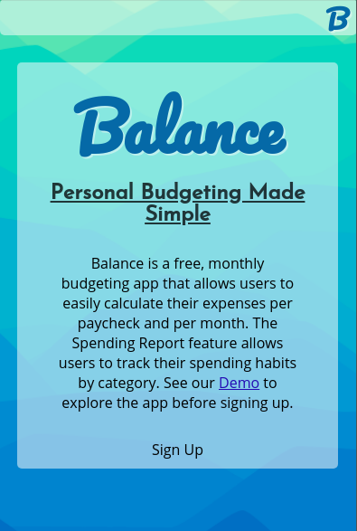
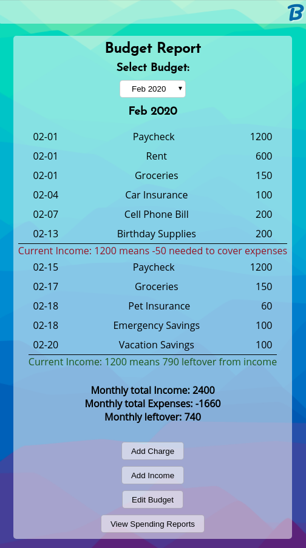
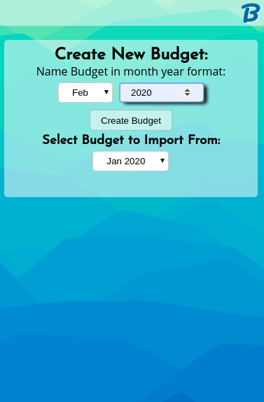
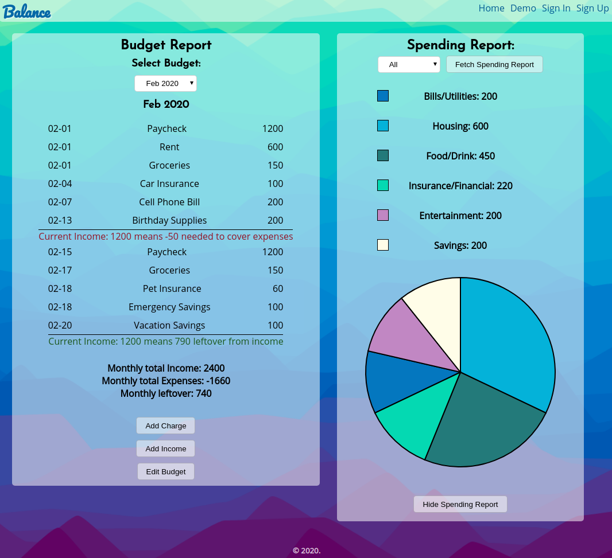

Balance is paycheck-to-paycheck and monthly budgeting app. Designed with simplicity in mind, this app allows users to create personal budgets for each month and re-use their budgets as templates for new months.

# Approach

This is a mobile-first application with a focus on ease-of-use and intuitive user experience.

[Trello Board Planning](https://trello.com/b/slnb3nlj/balance-app)

# Tech

- HTML
- CSS
- AOS Scrolling
- Animate CSS
- JavaScript
- React
- Enzyme

# APIs

1. [Balance-API](https://github.com/Cosmic-Noir/balance-api)
   - Accompanying server built with express to securely store site and user data.
   - Utilized all endpoints.

# Features

- Allows user to create a personal account.
- Users can create custom, monthly budgets.
- Users can create new budgets with previous custom templates.
- Users can edit/delete all charges/income with updated monthly reports.
- Users can view Monthly Spending Report to asses categorical spending.

# Demo

- [Balance Live](https://balance-app.cosmicnoir.now.sh/)

## ScreenShots

###### Mobile Home Screen

###### Mobile Budget Report

###### Mobile Create New Budget Form

###### Desktop Budget with Spending Report

